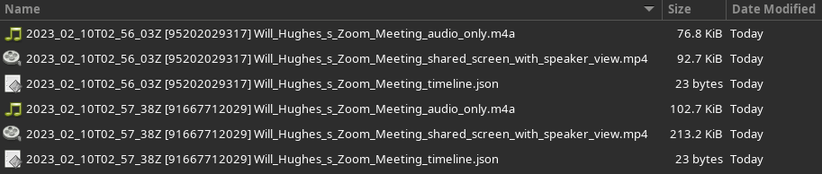

# ZoomWebRecordArchive

> **Note**
> 
> The following sample application is a personal, open-source project shared by the app creator and not an officially supported Zoom Video Communications, Inc. sample application. Zoom Video Communications, Inc., its employees and affiliates are not responsible for the use and maintenance of this application. Please use this sample application for inspiration, exploration and experimentation at your own risk and enjoyment. You may reach out to the app creator and broader Zoom Developer community on https://devforum.zoom.us/ for technical discussion and assistance, but understand there is no service level agreement support for this application. Thank you and happy coding!

Zoom Webhook cloud recording archiver.

This is a simple app that demonstrates how to use the Zoom recording.complete webhook to automatically download all cloud recordings.

All cloud recordings on the account will be saved to `./downloads/<user email>/<Date> [<Meeting ID>] <Meeting Topic>-<recording_type>.<ext>`

Example: `user@user.com/2023_02_10T02_56_03Z [95202029317] Zoom_Meeting_shared_screen_with_speaker_view=.mp4`



# Getting Started

These instructions will get you a copy of the project up and running on your local machine.

**Prerequisites:**

- [Zoom account](https://zoom.us)
- [Zoom Marketplace Account](https://marketplace.zoom.us/docs/guides)
- [Node.js 18+](https://nodejs.org/)

## Setup app locally

Clone and install the app and it's dependencies.

```bash
git clone https://github.com/Will4950/ZoomWebRecordArchive
```

```bash
cd zoomwebrecordarchive && npm install
```

### Setup dotenv

Create a `.env` file.

```bash
touch .env
```

Copy the following into this file, which we'll add your own values to:

```bash
SECRET_TOKEN=
```

# Create a Webhook Only app on the Zoom App Marketplace

Sign in to the Zoom App Marketplace and [Create a Webhook Only app](https://marketplace.zoom.us/develop/create?source=devdocs).

To create the app, we'll need to add some quick info. Add in the following:

1. _App Name_
2. _Company Name_
3. _Developer Name_
4. _Developer Contact_

### Add [Event Subscriptions](https://marketplace.zoom.us/docs/guides/tools-resources/webhooks#event-subscriptions)

Click the button next to `Event Subscriptions` to enable subscriptions, then Click **+ Add new event subscription**. Add in the following:

1. _Subscription Name_
2. _Event notification endpoint URL_

> NOTE: The endpoint URL must be accessible from the public internet. For testing, it is possible to use a ngrok https forwarding url.

With that info complete, click `Add Events`.

In the Event Types window we want to enable all recordings have completed.

Click `Recording`, then select `All Recordings have completed`.

Click `Done` when finished.

Click `Save`. Click `Continue` and activate the app.

## Update Secret token

On the `Feature` tab for your Webhook Only app, copy and paste the `Secret Token` to your `.env` file created earlier.

Example: `SECRET_TOKEN=RrLCDdAUTAO4955kKZwH1g`.

# Start the app

```bash
npm start
```
